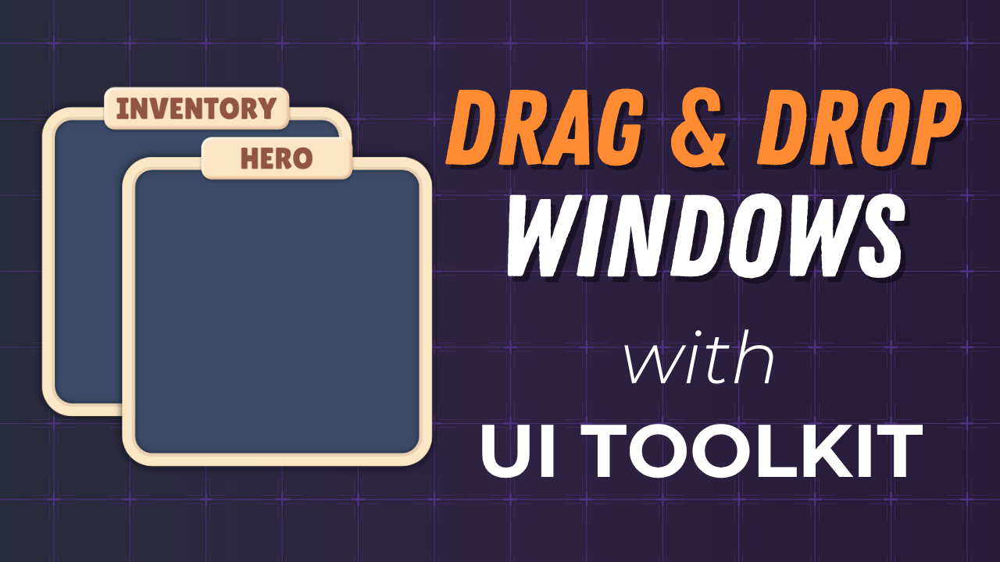

# Part 1: Reusable Window System

Build a reusable window system that you can drag around by the title bar, toggle on and off, click to bring to the front, and persist positions between game sessions. While no prior UI Toolkit experience is needed, it is assumed that you are comfortable with the Unity Editor and C#.

## Course

This tutorial is part of the **[Build Inventory & Equipment Systems with Unity UI Toolkit](https://www.youtube.com/playlist?list=PLUQd-0PkiOI5_msWheOHo-XnyEvQPLpbR)** course. The full course walks you through building a complete inventory and equipment system in Unity 6 using UI Toolkit. You'll start from scratch with a reusable window system, design the full UI layout in UI Builder, wire up drag-and-drop item management, render a 3D character preview, and connect everything to player data. No prior UI Toolkit experience needed.

Check out the other parts:

| Part | Topic |
| ---- | ----- |
| **1** | **Reusable Window System** (You are here) |
| 2 | [Design the Inventory UI](https://github.com/gamedev-resources/ui-toolkit-pt2-inventory-design) |
| 3 | [Create the Inventory Data Model](https://github.com/gamedev-resources/ui-toolkit-pt3-inventory-data-model) |
| 4 | [Inventory Interactions](https://github.com/gamedev-resources/ui-toolkit-pt4-inventory-interactions) |
| 5 | [Render a 3D Character Preview](https://github.com/gamedev-resources/ui-toolkit-pt5-equip-char-preview) |
| 6 | Equipping, Slot Validation & Mesh Swap |

## What's Included

- [`starter-project/`](starter-project/) -  The starter project to follow along with the tutorial.
- [`final-project/`](final-project/) - The completed project at the end of the tutorial.

## Resources

- [Full Playlist](https://www.youtube.com/playlist?list=PLUQd-0PkiOI5_msWheOHo-XnyEvQPLpbR)
- [Unity UI Toolkit Documentation](https://docs.unity3d.com/6000.0/Documentation/Manual/UIElements.html)